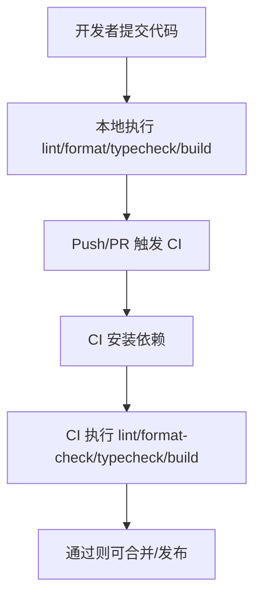

## 1. 产品概述

为 NeoBlock 提供一套基于 npm workspaces 的 TypeScript Monorepo 基础设施，包含 Web（Next.js）与 Server（Node.js）两端应用及可复用的 packages，统一脚本、代码规范与 CI，便于团队协作与持续交付。

## 2. 核心功能

### 2.1 功能模块

1. **Monorepo 工作区结构**：apps/web、apps/server、packages/shared、packages/ui、packages/rules。
2. **统一工程规范**：统一 TypeScript 配置、lint、format、忽略规则与编辑器基础配置。
3. **统一脚本**：根目录提供 build/dev/lint/format/typecheck 等脚本，一键在所有 workspace 执行。
4. **CI 校验**：在 PR/Push 上执行安装、lint、format check、typecheck、build（可选 test）。

### 2.2 页面/模块明细

| 工作区          | 模块名称     | 功能描述                                                                         |
| --------------- | ------------ | -------------------------------------------------------------------------------- |
| apps/web        | Next.js 应用 | 提供 TS + App Router 的 Web 入口，支持从 packages/ui 与 packages/shared 直接引用 |
| apps/server     | Node 服务    | 提供 TS 的 HTTP 服务入口，支持从 packages/shared 引用通用逻辑                    |
| packages/shared | 共享逻辑     | 提供跨端可复用的类型/工具函数，纯 TS，无运行时依赖                               |
| packages/ui     | 共享组件库   | 提供 React 组件与样式基础，作为 Next.js 的内部依赖使用                           |
| packages/rules  | 规则与配置   | 提供 ESLint/Prettier/TS 等共享配置与约定的集合（以“可导入/可复用”为目标）        |

## 3. 核心流程

开发者在根目录执行脚本完成日常工作；CI 在远端重复执行相同校验，保证一致性。

## 4. 用户界面设计

### 4.1 设计风格

- 本任务聚焦工程基础设施，不限定 UI 风格；Web 端保留可扩展的 UI 组件库与全局样式入口。

### 4.2 响应式

- 采用桌面优先开发方式，确保移动端自适应（由 apps/web 具体业务页面决定）。
