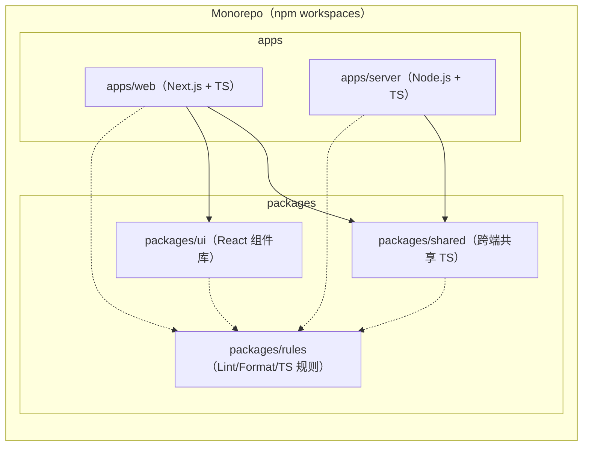
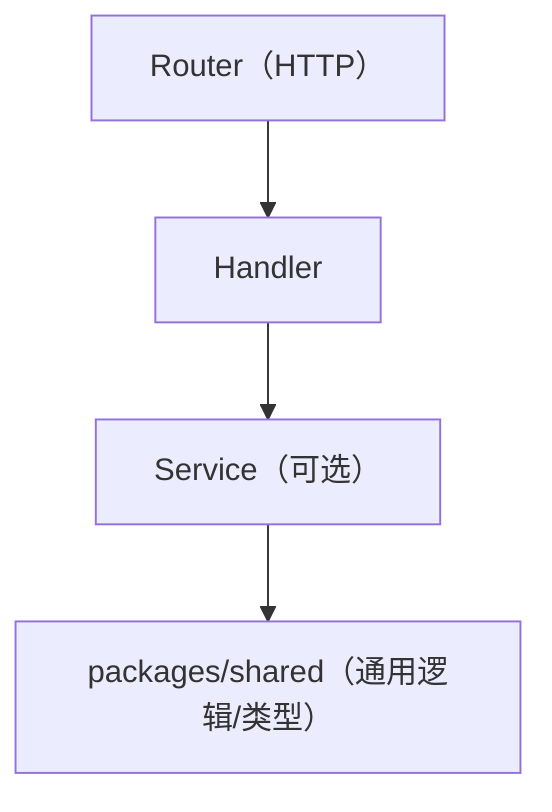

## 1. 架构设计

## 2. 技术说明

- 包管理器：npm（workspaces）
- 语言：TypeScript（统一 tsconfig 基线 + 各 workspace 继承）
- Web：Next.js（React + App Router）+ ESLint（Next 推荐规则）+ Prettier
- Server：Node.js（ESM/或 CJS 以 repo 约定为准）+ TS 编译产物 dist
- 代码规范：ESLint + Prettier；统一在根目录提供脚本与配置，并允许 workspace 覆盖少量差异
- CI：GitHub Actions（node + npm cache），运行 lint/format-check/typecheck/build

## 3. 路由定义

| 路由 | 用途                   |
| ---- | ---------------------- |
| /    | Web 应用入口（示例页） |

## 4. API 定义（Server）

| 方法 | 路径     | 用途     |
| ---- | -------- | -------- |
| GET  | /healthz | 健康检查 |

## 5. 服务端架构图

## 6. 数据模型

- 本任务不引入数据库；若后续需要持久化，优先以“可插拔”的方式添加（例如 Prisma + PostgreSQL/SQLite）。
